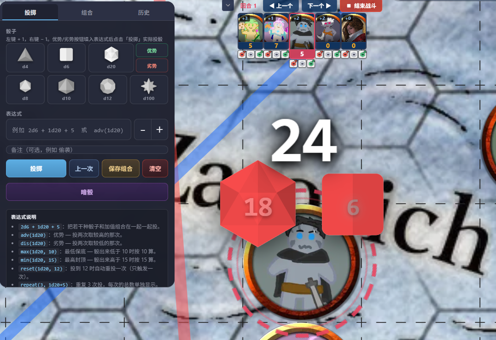
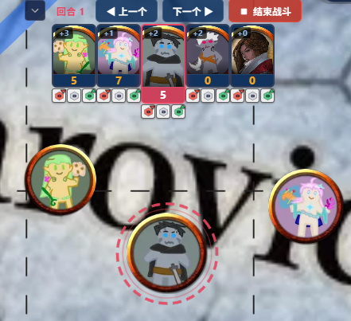
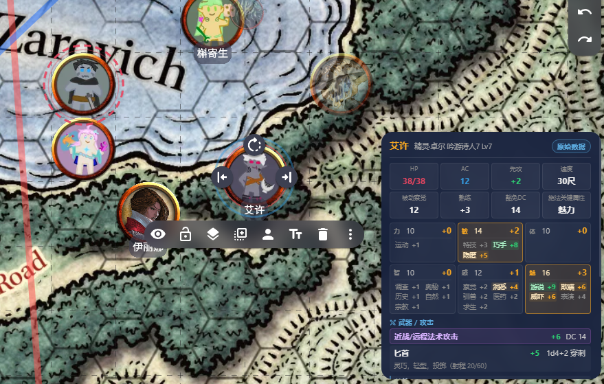
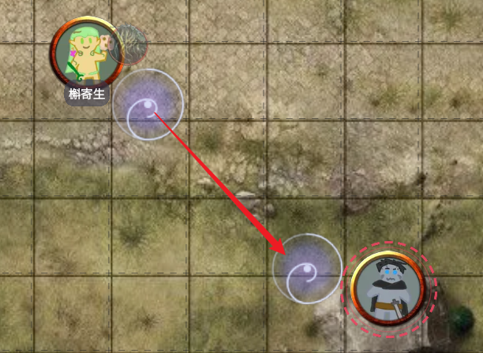

# Full Suite

[中文](./README.zh.md) · English

<p align="center">
  
</p>

A third-party extension for [Owlbear Rodeo](https://owlbear.rodeo) that ships eight modules under one manifest.

## Install

In an OBR room, click the ⊕ "Add Extension" button (top right) and paste:

```
https://obr.dnd.center/suite/manifest.json
```

## Modules

| Icon | Module | Description |
|---|---|---|
|  | Dice | Expression-based rolls, multi-target, history, replay, SFX, and 5etools tag integration. |
|  | Initiative | Top-anchored initiative strip. Includes start-combat, turn-change camera focus, and owner-aware roll / end-turn for player-owned tokens. |
|  | Bestiary | 5etools monster search and one-click spawn; tokens have right-click menus to bind / replace / unbind a monster reference; per-scene "auto-join initiative on spawn" toggle. |
|  | Character Cards | Parses xlsx character sheets (悲灵 v1.0.12 template) into a web view; each card row has a ↻ button to re-pick the xlsx and overwrite the card; the info popover surfaces when a bound token is selected. |
|  | Global Search | Top-right floating search input over all 5etools categories with hover-to-preview and click-to-pin. |
|  | Time Stop | DM-only freeze of player canvas input with cinematic letterbox bars. |
|  | Sync Viewport | Pans every player's camera to a chosen point or the selected token. |
|  | Portals | Drag-circle scene portals with same-tag linking; bypasses Dynamic Fog's light-source rejection during the position update. |

## Screenshots

<table>
  <tr>
    <td align="center" width="50%">
      
      <br/><sub>Dice expressions and fly-in animation</sub>
    </td>
    <td align="center" width="50%">
      
      <br/><sub>Top-anchored initiative strip with turn cycling</sub>
    </td>
  </tr>
  <tr>
    <td align="center" width="50%">
      
      <br/><sub>Character card popover · click-to-roll</sub>
    </td>
    <td align="center" width="50%">
      
      <br/><sub>Portal tool · destination picker</sub>
    </td>
  </tr>
</table>

## Dice expression syntax

```
Basic              2d6 + 1d20 + 5
Advantage          adv(1d20)              roll twice, keep higher
Disadvantage       dis(1d20)              roll twice, keep lower
Elven Accuracy     adv(1d20, 2)           roll three times, keep highest
Floor              max(1d20, 10)          value not below 10
Ceiling            min(1d20, 15)          value not above 15
Triggered reroll   reset(1d20, 1)         reroll once when value equals 1
Burst              burst(2d6)             max-roll explodes; chain length 5
Same highlight     same(2d20)
Repeat             repeat(3, 1d20+5)      3 independent rows, each its own total
Independent seg    adv(1d6) + adv(1d4)    two independent advantage rolls
Nested             adv(max(1d20, 10) + 5)
```

Chinese punctuation `（）` and `，` is normalised automatically.

## 5etools tag integration

`{@dice}`, `{@damage}`, `{@hit}`, `{@d20}`, `{@chance}`, `{@scaledice}`, `{@scaledamage}`, `{@recharge}` are all click-to-roll inside search previews, monster panels and character cards.

- Monster panel: left-click rolls open; right-click opens a menu (Roll / Dark Roll / Advantage / Disadvantage / Add to Tray).
- Character card abilities: the letter triggers a saving throw (with proficiency); the modifier triggers a check.
- Character card weapons: attack bonus and damage dice are both clickable.
- Card bottom "Traits / Feats / Spells" chips: clicking fills the global search input.

## Bestiary binding model

Each token stores a `com.bestiary/slug` metadata reference. The full monster data lives in scene metadata under `com.bestiary/monsters` as a shared lookup table (one entry per monster type).

- A token without a slug shows "Bind Monster" in its right-click menu.
- A token with a slug shows "Replace Monster" and "Unbind".
- Binding and replacement also rewrite the token's bubbles HP/AC, name and DEX modifier to match the new monster.

## Portal workflow

1. The DM activates the "Portal" tool from the left-rail toolbar.
2. Click and drag on the map: the click point becomes the centre, the drag distance becomes the radius.
3. On release, an edit panel opens for naming (e.g. "1F") and tagging (e.g. "001").
4. When a player drops a token inside a portal, a destination panel lists every same-tag portal in the scene.
5. Picking a destination gathers every selected token to it in a hex-spiral arrangement.

### Dynamic Fog compatibility

OBR's official Dynamic Fog extension blocks light-emitting tokens from entering fog regions by re-positioning them. To allow portal teleports through fog, this extension snapshots and removes the token's light metadata (any key whose value carries `attenuationRadius` or `sourceRadius`) immediately before the position update, then restores the original values 1:1 right after.

## Data source

The default library is the Chinese 5etools mirror at `https://5e.kiwee.top`. Custom libraries can be added under Settings → Libraries; they must serve the same `search/index.json` + `data/*.json` layout.

## Project layout

```
obr-suite/
├── public/manifest.json
├── src/
│   ├── background.ts
│   ├── cluster.ts
│   ├── settings.ts
│   ├── state.ts
│   └── modules/
│       ├── dice/         (panel / effect / history / replay / sfx)
│       ├── initiative/   (Preact tree)
│       ├── bestiary/
│       ├── characterCards/
│       ├── search/
│       ├── portals/
│       ├── timeStop.ts
│       └── focus.ts
└── *.html (iframe entries)
```

Stack: TypeScript + Vite + Preact (initiative panel only) + `@owlbear-rodeo/sdk` v3.x.

Cross-client state lives in scene metadata (`com.obr-suite/state`); DM writes, players read.

Per-client preferences live in localStorage (cluster expanded, auto-popup toggles, dice SFX, dice history, etc.).

## License

[PolyForm Noncommercial License 1.0.0](./LICENSE)

| | |
|---|---|
|  | View, modify, fork, and non-commercial distribution permitted |
|  | Required notice: `Copyright (c) 2026 FullPeople` must remain |
|  | Commercial use prohibited |

## Credits

- Dice icon: [flaticon](https://www.flaticon.com/) by [Freepik](https://www.flaticon.com/authors/freepik)
- Dice SFX: Sound Effect by [freesound_community](https://pixabay.com/users/freesound_community-46691455/) and ksjsbwuil from [Pixabay](https://pixabay.com/)
- 5etools data: [5e.kiwee.top](https://5e.kiwee.top) (Chinese mirror)
- D&D 5e content © Wizards of the Coast; this extension is a reference and play aid only.

## Support

[](https://ko-fi.com/fullpeople)
[](https://ifdian.net/a/fullpeople)

## Contact

- Email: [1763086701@qq.com](mailto:1763086701@qq.com)
- GitHub: [@FullPeople](https://github.com/FullPeople)
- Self-hosted at [obr.dnd.center](https://obr.dnd.center)
