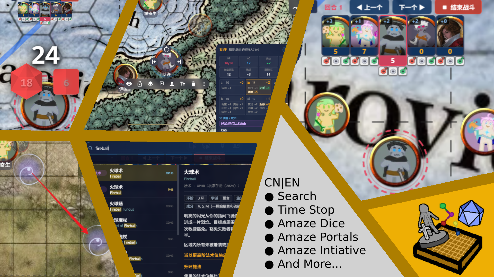

# Full Suite

<p align="center">
  
</p>

An [Owlbear Rodeo](https://owlbear.rodeo) extension that bundles eight modules behind a single manifest: dice, initiative tracker, bestiary, character cards, global search, time stop, sync viewport, and portals.

```
https://obr.dnd.center/suite/manifest.json
```

---

##  Documentation

| | |
|---|---|
|  中文 | [README.zh.md](./README.zh.md) |
|  English | [README.en.md](./README.en.md) |

---

## License

[PolyForm Noncommercial License 1.0.0](./LICENSE) — derivative works permitted with attribution; commercial use prohibited.

Copyright © 2026 FullPeople — [github.com/FullPeople](https://github.com/FullPeople)
