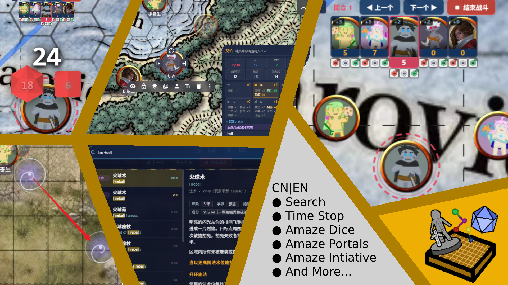

# Full Suite

<p align="center">
  
</p>

An [Owlbear Rodeo](https://owlbear.rodeo) extension that bundles nine modules behind a single manifest: dynamic fog, dice, initiative tracker, bestiary, character cards, global search, time stop, sync viewport, and portals.

```
https://obr.dnd.center/suite/manifest.json
```

<sub>Testing channel (may break, not for tables you care about): `https://obr.dnd.center/suite-dev/manifest-dev.json` — install one or the other, never both in the same room.</sub>

Stable remains **1.3.0**. Dev **1.0.153-dev** adds scene-backed music storage when room storage is full and protects website playback when initial pairing fails. Music Studio **20260910-storage** is deployed alongside it. See the [hotfix record and test checklist](docs/DEV_HOTFIX_20260910_SCORING_MUSIC.md); the earlier shared baseline is documented in the [1.3.0 release record](docs/RELEASE_20260909_SUITE_1_3_0.md).

Standalone **Three-Dragon Ante 0.3.2-dev** fixes scoring content occasionally disappearing after a round banner. It retains the round 3D table, aligned ante/flight regions for 2–6 players, supplied coins over each player's ante card, original card proportions and single-dragon vector backs. Creator settings, the two-page guide, approved printed-rule differences, live ability explanations and staged scoring remain. Everyone refreshes; existing 0.3.0 tables remain compatible. [Install the optional card table](https://obr.dnd.center/three-dragon-ante-dev/manifest.json) and use the [hotfix test checklist](docs/DEV_HOTFIX_20260910_SCORING_MUSIC.md). Complete English XLSX downloads and character-server parser patches remain outside this release; follow the [active goal](docs/ACTIVE_GOAL_20260910.md) for unfinished work.

---

##  Documentation

| | |
|---|---|
|  中文 | [README.zh.md](./README.zh.md) |
|  English | [README.en.md](./README.en.md) |

Historical running versions on 2026-09-08 were stable **1.2.2**, dev **1.0.148-dev**. The [source and deployment baseline](./docs/DEPLOYMENT_BASELINE_20260908.md) preserves that audit; current deployments are listed above.

The [product review and roadmap](./docs/PRODUCT_REVIEW_20260908.md) covers loading and interface improvements, party vision, Boss bars, Three-Dragon Ante, English localization, music, transitions, and longer-term research. The user has canceled shared pointers and moved Three-Dragon Ante into an independent extension. Proposed features are explicitly marked as unimplemented.

---

## License

[GNU General Public License v3.0](./LICENSE) — strong copyleft. Copy / modify / redistribute / use commercially, provided derivative works keep the GPL-3.0 license and source.

Copyright © 2026 FullPeople — [github.com/FullPeople](https://github.com/FullPeople)

The `bubbles` module is informed by [Stat Bubbles for D&D](https://github.com/SeamusFinlayson/Bubbles-for-Owlbear-Rodeo) by Seamus Finlayson, also under GPL-3.0.
